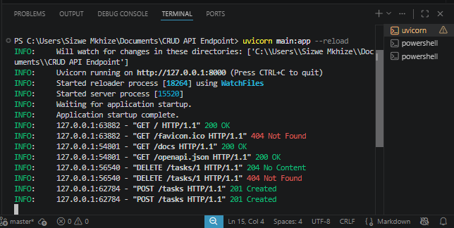
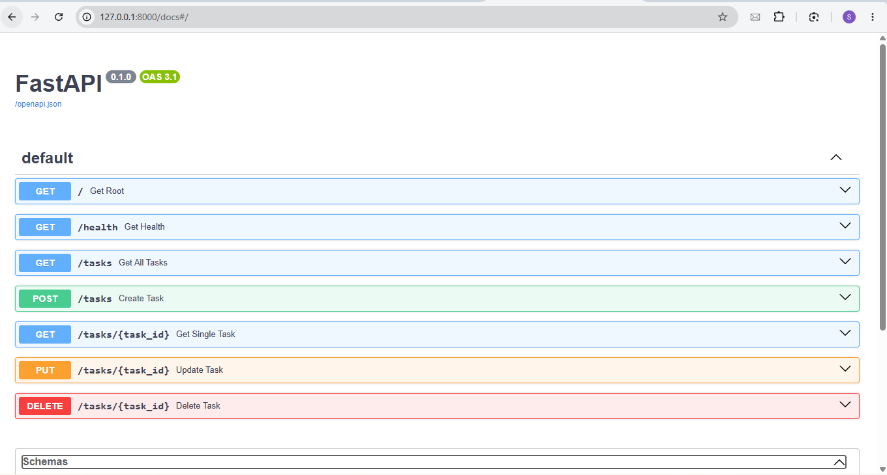

# 📝 Task Management CRUD API

A lightweight, high-performance RESTful CRUD API built with Python and FastAPI for managing a to-do list in-memory.

## 🚀 Quick Start Guide

### Prerequisites
* Python 3.10+
* Virtual Environment (optional but recommended)

1. **Install dependencies:**
   ```bash
   pip install fastapi uvicorn pydantic
   uvicorn main:app --reload
   
   

   # 📝 Task Management SQLite CRUD API

A persistent, high-performance RESTful CRUD API built with Python, FastAPI, and SQLite for managing tasks on disk.

---

## 🏛️ Storage Architecture: Why SQLite?

In Week 3, this system evolved from short-term in-memory storage to a persistent relational database using **SQLite**.

* **Serverless & Zero Config:** SQLite runs directly inside the Python process (`sqlite3`) without requiring external database server installation or port mapping.
* **Single-File Storage:** All persistent rows live in a local disk file (`tasks.db`), created automatically upon application startup.
* **Data Persistence:** Records survive server reboots, script crashes, and environment restarts.

---

## 🚀 How to Run (Clean Clone)

1. **Clone the repository:**
   ```bash
   git clone [https://github.com/YOUR_USERNAME/CRUD-API-Endpoint.git](https://github.com/YOUR_USERNAME/CRUD-API-Endpoint.git)
   cd CRUD-API-Endpoint